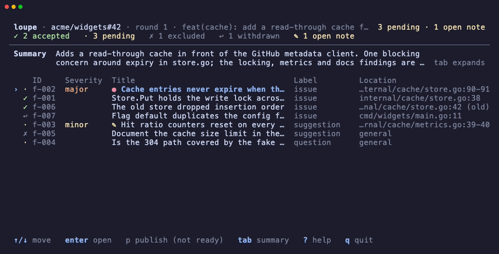
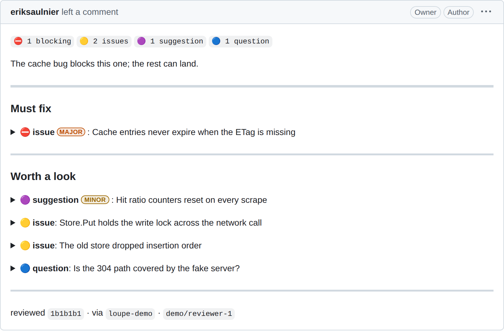
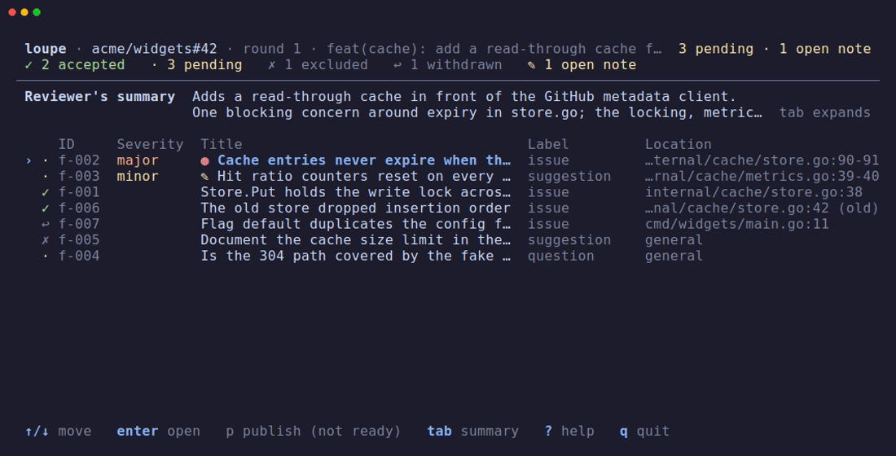

# loupe

[](https://github.com/eriksaulnier/loupe/actions/workflows/ci.yml) [](https://github.com/eriksaulnier/loupe/actions/workflows/release.yml)

loupe collects a review agent's findings into a local draft so you decide each one and publish a single GitHub review.



## Why loupe

- **Nothing posts under your name unread.** You accept or drop each finding yourself, and one confirmation sends the review.
- **Findings are files on disk.** One directory per run. No daemon, no database, no service to sign up for.
- **Any review agent works.** loupe has no opinion on how findings are found. It takes them through a CLI.

## How it works

1. An agent captures the pull request into a run, a local draft of one review round, and files findings.
2. You decide each finding in `loupe review`.
3. `loupe publish` shows the review it would send. You write its opening, and one key posts exactly one GitHub review. The agent's summary is only for you and is not published.

<picture>
  <source media="(prefers-color-scheme: dark)" srcset="docs/assets/review-dark.png">
  
</picture>

## Install

```sh
mise use -g github:eriksaulnier/loupe@latest
loupe --version
```

> [!NOTE]
> mise hides releases younger than its `minimum_release_age`, so right after a release this fails with `no versions found for github:eriksaulnier/loupe matching date filter`. Wait, or run `mise settings add minimum_release_age_excludes "github:eriksaulnier/loupe"`.

## Try it

In a clone, `mise run demo` opens `loupe review` on seeded runs against an in-memory GitHub. You can try the interface and the whole publish flow end to end, the final `y` included, and nothing leaves the machine. `mise run demo -- <loupe args>` runs any other command: `acme/widgets#42` is mid-review, `#43` is ready to publish, and `#44` is ready but its pull request's head has moved since capture.

## Setting up an agent

### Plugin

One plugin for Claude Code, Codex and Pi. Its `human-review` skill is the workflow a review skill or agent follows: capture the pull request, file findings, hand the run to you, and answer your send-back notes. It brings no review method of its own.

```sh
# Claude Code
claude plugin marketplace add eriksaulnier/loupe
claude plugin install loupe@loupe

# Codex
codex plugin marketplace add eriksaulnier/loupe
codex plugin add loupe@loupe

# Pi, pinned to the release. Use the version loupe --version prints.
pi install git:github.com/eriksaulnier/loupe@v0.10.0 # x-release-please-version
```

> [!IMPORTANT]
> Update the binary whenever you update the plugin. Claude Code and Codex install the plugin from `main`, so a skill can name a flag an older binary lacks.

> [!IMPORTANT]
> Inside the Codex sandbox, loupe cannot reach GitHub, the clone's `.git`, its data directory or the terminal host's socket (Herdr or Orca, below). Approve the skill's requests to run `loupe` outside the sandbox. Pi has no sandbox.

Sending a finding back with a note asks the agent about the finding: the agent answers, you resolve the note, and only then does the finding count as decided.



### Adapting a review skill you already have

A review skill written before loupe usually ends by posting to GitHub or printing its findings. `human-review` forbids the first and replaces the second, so the old skill needs an edit before the two work together. Give your agent this prompt, with the path filled in:

```text
Edit the review skill at <path> so it hands its findings to loupe through the `human-review` skill instead of posting them.

- Keep the review method unchanged: what the skill looks at, how it judges, and what it reports.
- Remove every step that posts to GitHub, by `gh pr review`, `gh api`, the GitHub MCP or any other route, and every step that presents the findings as the final output.
- Add a step before the review that follows `human-review` sections 1 and 2, and make the review read the change at the `target.headSha` that `loupe capture --json` printed.
- Add a step after the review that follows `human-review` sections 3 to 7. The edited skill MUST point at `human-review` and `loupe add --help` for the finding fields instead of listing them.
- Map the skill's own severity or priority words onto loupe's `severity`, `blocking` and `label`. Where a word has no clear match, leave the field unset. MUST NOT guess.
- If the skill also runs in CI, use the same capture and filing steps in CI and locally, skip `handoff` and `wait` when no human is present (for example when `CI` is set), and write the summary for the pull request's author, because an unattended round publishes it as the review's opening.
- Show me the diff and the severity mapping before you save anything.
```

### Handing off in a terminal pane

Inside [Herdr](https://herdr.dev) or Orca, `loupe handoff` opens `loupe review` in a split beside the agent's pane, and the pane closes when review exits cleanly. Elsewhere, or when the split fails, the skill asks you to run `loupe review` yourself.

To skip the approval prompt at each handoff, allow that one command:

- Claude Code: `Bash(loupe handoff:*)`
- Codex, in `~/.codex/rules/default.rules`: `prefix_rule(pattern=["loupe", "handoff"], decision="allow")`

loupe builds the pane's command itself from the run it is asked to open, so the rule lets an agent open review and nothing else. Do not allow `herdr pane split`, `herdr pane run` or `orca terminal split`. A blanket rule for any of them lets any command run in a new shell.

## Commands

`loupe --help` is the reference, and every command's `--help` shows its JSON input and result.

| Run by | Command | What it does |
| :--- | :--- | :--- |
| agent | `capture` | Capture a pull request into a new review round |
| agent | `add` | File findings into the draft |
| agent | `summary` | Set the summary that orients you while you sort findings |
| agent | `handoff` | Open review for the human in a new terminal pane |
| agent | `wait` | Block until the human sends a finding back or publishes |
| agent | `edit` | Change, withdraw or restore a finding |
| agent | `reply` | Answer a send-back note |
| agent | `feedback` | Read the human's notes, dispositions and readiness |
| anyone | `show` | Show the draft, dispositions and readiness |
| anyone | `list` | List every run with its state and counts |
| human | `review` | Decide each finding in the review interface |
| human | `publish` | Confirm and post the review to GitHub |

## Environment

| Variable | Meaning |
| :--- | :--- |
| `LOUPE_HOME` | Where runs are stored. The default is `$XDG_DATA_HOME/loupe`, else `~/.local/share/loupe` |
| `LOUPE_RUN` | The run a command acts on when it names none |
| `LOUPE_LOCK_TIMEOUT_MS` | How long to wait for a run's lock. Default 3000, maximum 60000 |
| `LOUPE_ICONS` | `ascii`, `unicode` (default) or `nerd` (needs a Nerd Font). A non-UTF-8 locale always gets ASCII |
| `NO_COLOR`, `TERM`, `LANG`/`LC_ALL` | Honored for color, plain-mode fallback and glyph selection |
| `GH_TOKEN`, `GITHUB_TOKEN` | The github.com token, checked in that order. Without either, loupe uses the one `gh auth login` stored |

[`contracts/cli.md`](specs/001-loupe-v1/contracts/cli.md#environment) has the exact rules and refusals for the `LOUPE_` variables.

## Unattended publish

A pipeline can review a pull request with no human and no terminal: capture, file, publish. Only capture needs the Git clone.

1. `loupe capture <pr-url> --json` creates the run and prints its reference as `run`. Pass that reference to the later steps as `--run <ref>` or in `LOUPE_RUN`. Unattended publish does not fall back to the current branch's pull request, because a pipeline's checkout is usually not on that branch.
2. `loupe show --diff > review/pr.diff` writes the captured diff for the reviewer to read beside a checkout of the captured head. This is the supported way to get the diff. The run directory's layout is not a contract.
3. File findings with one `loupe add` object or array, which is stored whole or not at all. A finding whose location is not in the captured diff is refused with the nearest valid lines. Then set `loupe summary`, even when there is nothing to report. In an unattended run it becomes the review's opening, and no human reads it first. You supply the adapter from your reviewer's output to `loupe add`'s input.
4. `loupe publish --unattended --json` posts exactly one comment review, with no confirmation. It needs a GitHub App installation token (prefix `ghs_`, which is what Actions' own `GITHUB_TOKEN` is) with `permissions: pull-requests: write`. With a user token, publish refuses with `token`. The run records each attempt and its receipt, so a pipeline that keeps `LOUPE_HOME` between steps can retry safely, even from another path or machine.

[`eriksaulnier/loupe-workflows`](https://github.com/eriksaulnier/loupe-workflows) is a worked example. It is a reusable workflow that installs a pinned loupe release, captures the pull request, runs an agent over the captured head and diff, and publishes unattended. Here, `.github/workflows/review.yml` is the caller, and `.github/review-instructions.md` tells the reviewer what to know about loupe's own code.

## Reference

- [Constitution](.specify/memory/constitution.md): the seven principles every change answers to.
- [CLI contract](specs/001-loupe-v1/contracts/cli.md): commands, input, results and errors.
- [Comment format](docs/comment-format.md): the published review format.
- [GitHub facts](docs/github-facts.md): observed GitHub behavior to design around.

## Contributing

[`CONTRIBUTING.md`](CONTRIBUTING.md) covers setup, local development, tests and commits. release-please and goreleaser cut releases. Nothing is tagged or released by hand.

## License

MIT. See [`LICENSE`](LICENSE).
