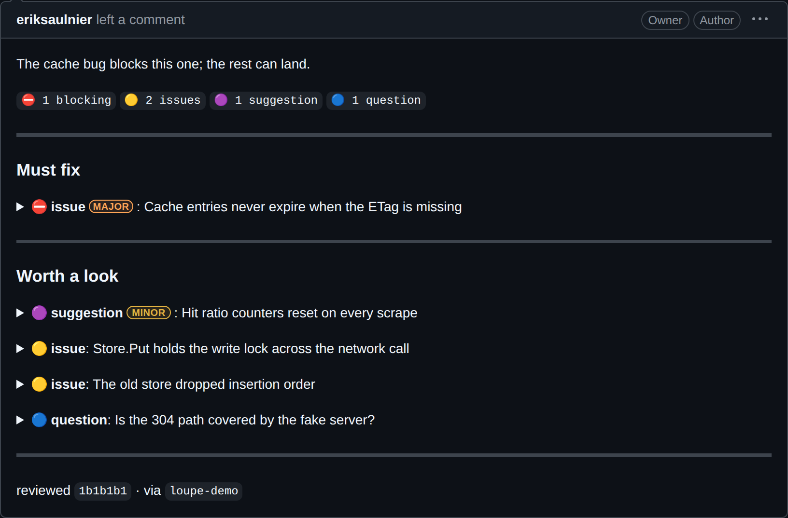

# loupe

[](https://github.com/eriksaulnier/loupe/actions/workflows/ci.yml) [](https://github.com/eriksaulnier/loupe/actions/workflows/release.yml)

loupe collects a review agent's findings into a local draft so you decide each one and publish a single GitHub review.


## Why loupe

- **Nothing posts under your name unread.** You accept or drop each finding yourself. You write the review's opening, and one confirmation sends one review.
- **Any review agent works.** loupe has no opinion on how findings are found. The agent files them through a CLI, and a plugin for Claude Code, Codex and Pi teaches it the workflow.
- **Findings are files on disk.** One directory per run. No daemon, no database, no service to sign up for.
- **Human and bot reviews read the same.** A CI job can publish through loupe too. Its review uses the same comment format. It is marked unattended and never approves or blocks a merge.

## How it works

1. Your agent captures the pull request into a run and files its findings into the draft.
2. You decide each finding in `loupe review`. A finding you send back with a note goes to the agent, which answers it.
3. `loupe publish` shows the exact review. You write its opening, and one key posts it.



This is what a published review looks like. A CI review uses the same format. See [Comment format](docs/comment-format.md).

## Install

```sh
mise use -g github:eriksaulnier/loupe@latest
claude plugin marketplace add eriksaulnier/loupe
claude plugin install loupe@loupe
```

The first line installs the binary. The other two add the agent plugin to Claude Code. [Install](docs/install.md) covers Codex, Pi, release archives and GitHub Actions.

To try the interface without a pull request, run `mise run demo` in a clone. It opens `loupe review` on seeded runs against an in-memory GitHub, so nothing leaves the machine.

## Documentation

- [Install](docs/install.md): the binary, the agent plugin for each host, and updating the two together.
- [Comment format](docs/comment-format.md): what a published review looks like on GitHub.
- [The review workflow](docs/review-workflow.md): the attended loop, the pane hand-off, adapting a review skill you already have, and the command and environment reference.
- [Unattended reviews in CI](docs/ci-action.md): the GitHub Action, the pipeline steps, sticky rounds and the rules an unattended review follows.
- [CLI contract](specs/001-loupe-v1/contracts/cli.md): commands, input, results and errors, for scripting against loupe.
- [Constitution](.specify/memory/constitution.md): the seven principles every change answers to.
- [Contributing](CONTRIBUTING.md): setup, local development, tests, commits and releases.

## License

MIT. See [LICENSE](LICENSE).
