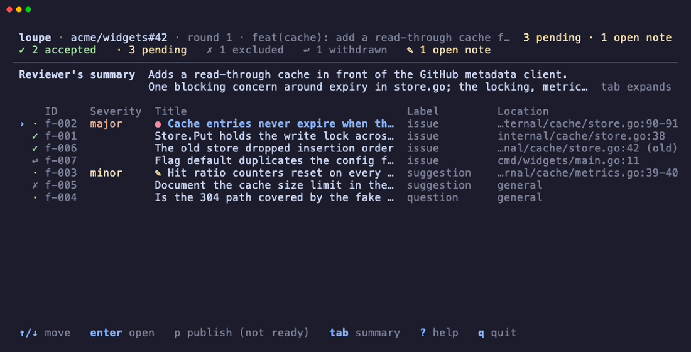
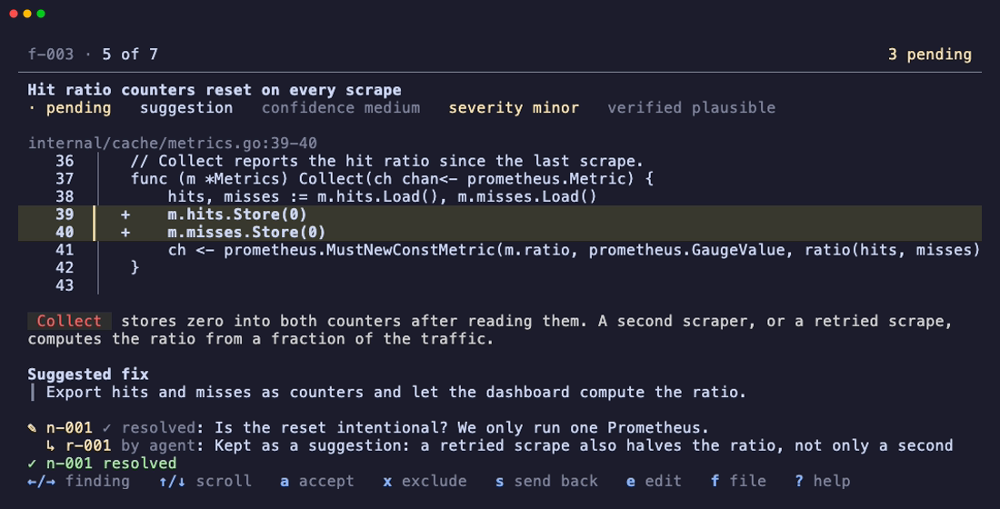
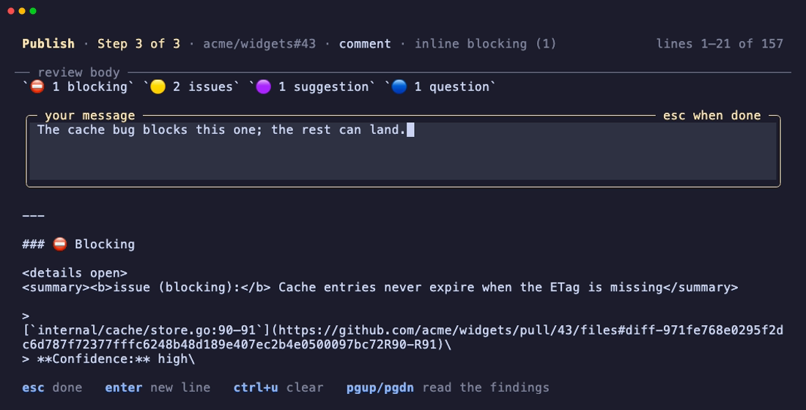

# loupe

[](https://github.com/eriksaulnier/loupe/actions/workflows/ci.yml) [](https://github.com/eriksaulnier/loupe/actions/workflows/release.yml)

loupe files pull request review findings for a human to decide and publish.

1. An agent captures the pull request into a local draft and files findings.
2. You decide each finding in `loupe review`.
3. `loupe publish` posts exactly one confirmed GitHub review.


## Install

```sh
mise use -g github:eriksaulnier/loupe@latest
loupe --version
```

- **A release cut today** fails with `no versions found for github:eriksaulnier/loupe matching date filter`, because mise hides releases younger than its `minimum_release_age`. Wait, or exempt loupe: `mise settings add minimum_release_age_excludes "github:eriksaulnier/loupe"`.

## Agent plugin

One plugin for Claude Code, Codex and Pi. Its `human-review` skill is the workflow a review skill or agent follows: capture the pull request, file findings, hand the run to you, and answer your send-back notes. It brings no review method of its own.

```sh
# Claude Code
claude plugin marketplace add eriksaulnier/loupe
claude plugin install loupe@loupe

# Codex
codex plugin marketplace add eriksaulnier/loupe
codex plugin add loupe@loupe

# Pi, pinned to the release; use the version loupe --version prints
pi install git:github.com/eriksaulnier/loupe@v0.7.0 # x-release-please-version
```

- **Keep plugin and binary together.** Claude Code and Codex install the plugin from `main`, so a skill can name a flag an older binary lacks.
- **Codex sandbox:** loupe cannot reach GitHub, the clone's `.git`, its data directory or the Herdr socket from inside it. Approve the skill's requests to run `loupe` outside the sandbox. Pi has no sandbox.

## Review in a Herdr pane

Inside [Herdr](https://herdr.dev), `loupe handoff` opens `loupe review` in a split beside the agent's pane, and the pane closes when review exits cleanly. Elsewhere, or when the split fails, the skill asks you to run `loupe review` yourself.

To skip the approval prompt at each hand-off, allow that one command:

- Claude Code: `Bash(loupe handoff:*)`
- Codex, in `~/.codex/rules/default.rules`: `prefix_rule(pattern=["loupe", "handoff"], decision="allow")`

loupe builds the pane's command from the run it resolves, so the rule lets an agent open review and nothing else. Do not allow `herdr pane split` or `herdr pane run`: a blanket rule for either lets any command run in a new shell.

## Commands

`loupe --help` is the reference, and every command's `--help` shows its JSON input and result.

| Who | Command | What it does |
| :--- | :--- | :--- |
| agent | `capture` | Capture a pull request into a new review round |
| agent | `add` | File findings into the draft |
| agent | `summary` | Set the review summary |
| agent | `handoff` | Open review for the human in a new Herdr pane |
| agent | `wait` | Block until the human hands notes back or publishes |
| agent | `edit` | Change, withdraw or restore a finding |
| agent | `reply` | Answer a send-back note |
| agent | `feedback` | Read the human's notes, dispositions and readiness |
| anyone | `show` | Show the draft, dispositions and readiness |
| anyone | `list` | List every run with its state and counts |
| human | `review` | Decide each finding in the review interface |
| human | `publish` | Confirm and post the review to GitHub |

## Environment

| Variable | Meaning |
| :--- | :--- |
| `LOUPE_HOME` | Where runs are stored; the default is `$XDG_DATA_HOME/loupe`, else `~/.local/share/loupe` |
| `LOUPE_RUN` | The run a command acts on when it names none |
| `LOUPE_LOCK_TIMEOUT_MS` | How long to wait for a run's lock; default 3000, maximum 60000 |
| `LOUPE_ICONS` | `ascii`, `unicode` (default) or `nerd` (needs a Nerd Font); a non-UTF-8 locale always gets ASCII |
| `NO_COLOR`, `TERM`, `LANG`/`LC_ALL` | Honored for color, plain-mode fallback and glyph selection |
| `GH_TOKEN`, `GITHUB_TOKEN` | The github.com token, checked in that order; without either, loupe uses the one `gh auth login` stored |

[`contracts/cli.md`](specs/001-loupe-v1/contracts/cli.md#environment) has the exact rules and refusals for the `LOUPE_` variables.

## Unattended publish

A pipeline reviews a pull request with no human and no terminal: capture, file, publish. Capture is the only step that needs the Git clone.

1. `loupe capture <pr-url> --json` creates the run and prints its reference as `run`. Pass that reference to the later steps, either as `--run <ref>` or by exporting it as `LOUPE_RUN`; unattended publish will not fall back to the pull request of a branch, since a pipeline's checkout is usually not sitting on it.
2. `loupe show --diff > review/pr.diff` writes the captured diff where the reviewer can read it, beside a checkout of the captured head. It is the supported way to get the diff out; the run directory's own layout is not a contract.
3. Something files findings and a summary through the input any agent uses: one `loupe add` object or array, stored entirely or not at all, and one `loupe summary`, set even when there is nothing to report. A finding whose location is not in the captured diff is refused with the nearest valid lines. loupe ships no adapter that turns a reviewer's output into this shape; a pipeline supplies its own, and this feature names no particular review action.
4. `loupe publish --unattended --json` posts exactly one comment review, with no confirmation and no terminal, once the resolved token is a GitHub App installation token: the `ghs_` prefix, which is what Actions' own `GITHUB_TOKEN` carries. The token needs `permissions: pull-requests: write`; a user token here refuses with `token`. Restoring the data root at a different path, even on a different machine, replays a receipt or reconciles an unknown attempt, so a pipeline that persists `LOUPE_HOME` between steps can retry safely.

[`eriksaulnier/loupe-workflows`](https://github.com/eriksaulnier/loupe-workflows) is a worked example: a reusable workflow that installs a pinned loupe release, captures the pull request, runs an agent over the captured head and diff, and publishes unattended. `.github/workflows/review.yml` here is the caller, and `.github/review-instructions.md` is what loupe asks a reviewer of its own code to know. loupe ships neither; the workflow is one caller of the publication layer, not part of it.

## Try it without a pull request

In a clone, `mise run demo` opens `loupe review` on seeded runs against an in-memory GitHub, so the interface and the whole publish flow, `y` included, can be tried end to end. Nothing leaves the machine. `mise run demo -- <loupe args>` runs any other command: `acme/widgets#42` is mid-review, `#43` is ready to publish, and `#44` is ready with a moved head.

The board, one finding, and the last screen before anything is sent:







## Contributing and releases

[`CONTRIBUTING.md`](CONTRIBUTING.md) covers setup, local development, tests and commits. release-please opens the release PR, merging it tags the release, and goreleaser attaches the archives and `checksums.txt`. Nothing is tagged or released by hand.

## Reference

- [Constitution](.specify/memory/constitution.md): the seven principles every change answers to.
- [CLI contract](specs/001-loupe-v1/contracts/cli.md): commands, input, results and errors.
- [Comment format](docs/comment-format.md): the published review format.
- [GitHub facts](docs/github-facts.md): observed GitHub behavior to design around.

## License

MIT. See [`LICENSE`](LICENSE).
