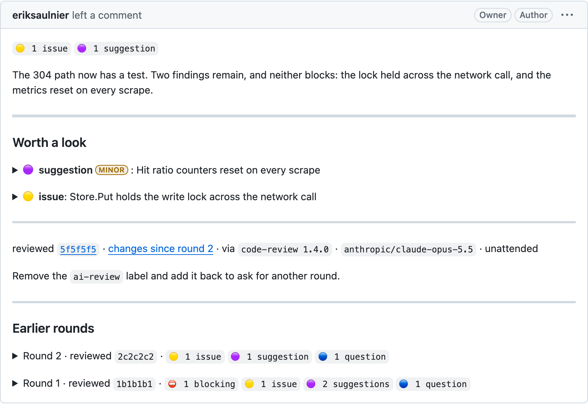

# Unattended reviews in CI

loupe is built for [the attended workflow](review-workflow.md), where a person decides each finding. A CI job can also review a pull request and publish through loupe with no one watching. The review then uses the same [comment format](comment-format.md) as one a person publishes, so human and bot reviews read the same way on the pull request.

## What an unattended review may do

No person reads an unattended review before it posts, so loupe holds it to fixed rules. These come from Principle II of the [constitution](../.specify/memory/constitution.md).

- It MUST authenticate with a GitHub App installation token, which starts with `ghs_`, and it posts as that App. Actions' own `GITHUB_TOKEN` is one. A user token is refused with `token`.
- It MUST be a COMMENT review. It never approves and never requests changes, so it never approves or blocks a merge.
- It is marked unattended in its footer and in its hidden metadata, so it never reads as a person's review.
- It MUST edit only a review that a GitHub App published.
- Its opening comes from the draft's summary. Write the summary for the pull request's author, because no one reads it first.
- It publishes every accepted or pending finding, since no one decides them one by one. A finding that was excluded or withdrawn is left out.

## Install loupe in a job

The repository is also an action. It installs a release, checks the archive against the release's `checksums.txt` and puts `loupe` on `PATH` for the rest of the job. It runs on Linux and macOS, on amd64 and arm64.

```yaml
- uses: eriksaulnier/loupe@<sha> # <tag>
```

Pin the commit sha of a release tag, with the tag in a comment. The action installs the release it shipped in, so Dependabot moves the action and the binary together. To install another release, set `version`, for example `version: v0.9.0`.

## The pipeline

A pipeline reviews a pull request in four steps: capture, read, file, publish. Only capture needs the Git clone.

1. `loupe capture <pr-url> --json` creates the run and prints its reference as `run`. Pass that reference to the later steps in `LOUPE_RUN`, or name it on each one: `--run <ref>` for `show`, `add` and `summary`, and as the argument of `loupe publish <ref>`. Unattended publish does not fall back to the current branch's pull request, because a pipeline's checkout is usually not on that branch.
2. `loupe show --diff > review/pr.diff` writes the captured diff for the reviewer to read beside a checkout of the captured head. This is the supported way to get the diff. The run directory's layout is not a contract.
3. File findings with one `loupe add` object or array, which is stored whole or not at all. A finding whose location is not in the captured diff is refused with the nearest valid lines. Then set `loupe summary`, even when there is nothing to report. You supply the adapter from your reviewer's output to `loupe add`'s input.
4. `loupe publish --unattended --json` posts exactly one comment review, with no confirmation. The job needs `permissions: pull-requests: write`. The run records each attempt and its receipt. A pipeline that keeps `LOUPE_HOME` between steps can retry safely, even from another path or machine.

## Sticky rounds

A pull request that gets a round on every push collects one review per round. `loupe publish --unattended --sticky` keeps one review current instead. The first sticky round posts a review. Each later round replaces that review's body, with the new round on top and earlier rounds collapsed below it. An edit sends no notification.

Sticky finds the review to edit by the capture's `--source` name. Unattended `--sticky` refuses a run captured without one. Each unattended pipeline on a repository MUST use its own `--source` name, because two that share one pick or mix each other's reviews.

`--note <markdown>` adds a note under the new round's footer, such as how to ask for another round. It shows only while that round is the newest, so pass it again on each round that should carry one. It needs `--unattended --sticky`.

<picture>
  <source media="(prefers-color-scheme: dark)" srcset="assets/review-sticky-dark.png">
  
</picture>

## The shared review workflow

[`eriksaulnier/loupe-workflows`](https://github.com/eriksaulnier/loupe-workflows) is a reusable workflow built on these steps. It installs a pinned loupe release, captures the pull request, runs an agent over the captured head and diff, and publishes unattended.

loupe reviews its own pull requests with it:

- [`.github/workflows/review.yml`](../.github/workflows/review.yml) is the caller. It holds the triggers, the `REVIEW_ENABLED` kill switch, the permissions the called jobs need, the model and `sticky: true`. A round runs when a pull request is opened ready or marked ready for review. Each later round is asked for with the `ai-review` label.
- [`.github/review-instructions.md`](../.github/review-instructions.md) tells the reviewer what to know about loupe's own code. The workflow reads it from the default branch, never from the pull request.

## GitHub's behavior

[GitHub facts](github-facts.md) records what GitHub was observed to do with reviews, edits, inline comments, Markdown and Actions tokens. Treat it as evidence, not as a promise about future behavior.
